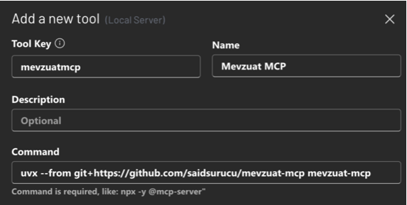

# Mevzuat MCP: Adalet Bakanlığı Mevzuat Bilgi Sistemi için MCP Sunucusu

Bu proje, Adalet Bakanlığı'na ait Mevzuat Bilgi Sistemi'ne (`mevzuat.gov.tr`) erişimi kolaylaştıran bir [FastMCP](https://gofastmcp.com/) sunucusu oluşturur. Bu sayede, Mevzuat Bilgi Sistemi'nden mevzuat arama, madde listelerini getirme ve madde içeriklerini Markdown formatında alma işlemleri, Model Context Protocol (MCP) destekleyen LLM (Büyük Dil Modeli) uygulamaları (örneğin Claude Desktop veya [5ire](https://5ire.app)) ve diğer istemciler tarafından araç (tool) olarak kullanılabilir hale gelir.


🎯 **Temel Özellikler**

* Adalet Bakanlığı Mevzuat Bilgi Sistemi'ne programatik erişim için standart bir MCP arayüzü.
* Aşağıdaki yetenekler:
    * **Detaylı Mevzuat Arama:** Mevzuat adı/içeriği, mevzuat numarası, Resmi Gazete sayısı, mevzuat türü ve sıralama kriterleri gibi çeşitli filtrelere göre mevzuat arama.
    * **Madde Ağacı Listeleme:** Belirli bir mevzuatın içindekiler tablosunu (bölüm, madde başlıkları vb.) hiyerarşik bir yapıda getirme.
    * **Madde İçeriği Getirme:** Belirli bir maddenin tam metin içeriğini, işlenmiş ve temizlenmiş Markdown formatında getirme.
* Mevzuat metinlerinin LLM'ler tarafından daha kolay işlenebilmesi için HTML'den Markdown formatına çevrilmesi.
* Claude Desktop uygulaması ile kolay entegrasyon.
* Mevzuat MCP, [5ire](https://5ire.app) gibi Claude Desktop haricindeki MCP istemcilerini de destekler.

---
🚀 **Claude Haricindeki Modellerle Kullanmak İçin Çok Kolay Kurulum (Örnek: 5ire için)**

Bu bölüm, Mevzuat MCP aracını 5ire gibi Claude Desktop dışındaki MCP istemcileriyle kullanmak isteyenler içindir.

* **Python Kurulumu:** Sisteminizde Python 3.11 veya üzeri kurulu olmalıdır. Kurulum sırasında "**Add Python to PATH**" (Python'ı PATH'e ekle) seçeneğini işaretlemeyi unutmayın. [Buradan](https://www.python.org/downloads/) indirebilirsiniz.
* **Git Kurulumu (Windows):** Bilgisayarınıza [git](https://git-scm.com/downloads/win) yazılımını indirip kurun. "Git for Windows/x64 Setup" seçeneğini indirmelisiniz.
* **`uv` Kurulumu:**
    * **Windows Kullanıcıları (PowerShell):** Bir CMD ekranı açın ve bu kodu çalıştırın: `powershell -ExecutionPolicy ByPass -c "irm https://astral.sh/uv/install.ps1 | iex"`
    * **Mac/Linux Kullanıcıları (Terminal):** Bir Terminal ekranı açın ve bu kodu çalıştırın: `curl -LsSf https://astral.sh/uv/install.sh | sh`
* **Microsoft Visual C++ Redistributable (Windows):** Bazı Python paketlerinin doğru çalışması için gereklidir. [Buradan](https://learn.microsoft.com/en-us/cpp/windows/latest-supported-vc-redist?view=msvc-170) indirip kurun.
* İşletim sisteminize uygun [5ire](https://5ire.app) MCP istemcisini indirip kurun.
* 5ire'ı açın. **Workspace -> Providers** menüsünden kullanmak istediğiniz LLM servisinin API anahtarını girin.
* **Tools** menüsüne girin. **+Local** veya **New** yazan butona basın.
    * **Tool Key:** `mevzuatmcp`
    * **Name:** `Mevzuat MCP`
    * **Command:**
        ```
        uvx mevzuat-mcp
        ```
    * **Save** butonuna basarak kaydedin.

* Şimdi **Tools** altında **Mevzuat MCP**'yi görüyor olmalısınız. Üstüne geldiğinizde sağda çıkan butona tıklayıp etkinleştirin (yeşil ışık yanmalı).
* Artık Mevzuat MCP ile konuşabilirsiniz.

---
⚙️ **Claude Desktop Manuel Kurulumu**


1.  **Ön Gereksinimler:** Python, `uv`, (Windows için) Microsoft Visual C++ Redistributable'ın sisteminizde kurulu olduğundan emin olun. Detaylı bilgi için yukarıdaki "5ire için Kurulum" bölümündeki ilgili adımlara bakabilirsiniz.
2.  Claude Desktop **Settings -> Developer -> Edit Config**.
3.  Açılan `claude_desktop_config.json` dosyasına `mcpServers` altına ekleyin:

    ```json
    {
      "mcpServers": {
        // ... (varsa diğer sunucularınız) ...
        "Mevzuat MCP": {
          "command": "uvx",
          "args": [
            "mevzuat-mcp"
          ]
        }
      }
    }
    ```
4.  Claude Desktop'ı kapatıp yeniden başlatın.

🛠️ **Kullanılabilir Araçlar (MCP Tools)**

Bu FastMCP sunucusu LLM modelleri için aşağıdaki araçları sunar:

* **`search_mevzuat`**: Mevzuat Bilgi Sistemi'nde çeşitli detaylı kriterleri kullanarak arama yapar.
    * **Parametreler**: `mevzuat_adi`, `mevzuat_no`, `resmi_gazete_sayisi`, `search_in_title`, `mevzuat_turleri`, `page_number`, `page_size`, `sort_field`, `sort_direction`.
    * **Döndürdüğü Değer**: `MevzuatSearchResult` (sayfalanmış mevzuat listesi, toplam sonuç sayısı vb. içerir)

* **`get_mevzuat_article_tree`**: Belirli bir mevzuatın madde ve bölümlerini hiyerarşik bir ağaç yapısında listeler.
    * **Parametreler**: `mevzuat_id` (arama sonucundan elde edilen mevzuat ID'si).
    * **Döndürdüğü Değer**: `List[MevzuatArticleNode]` (iç içe geçmiş madde ve başlıkların listesi)

* **`get_mevzuat_article_content`**: Belirli bir mevzuat maddesinin tam metnini temizlenmiş Markdown formatında getirir.
    * **Parametreler**: `mevzuat_id`, `madde_id` (madde ağacından elde edilen madde ID'si).
    * **Döndürdüğü Değer**: `MevzuatArticleContent` (maddenin Markdown içeriği, metadata vb. içerir)

📜 **Lisans**

Bu proje MIT Lisansı altında lisanslanmıştır. Detaylar için `LICENSE` dosyasına bakınız.
